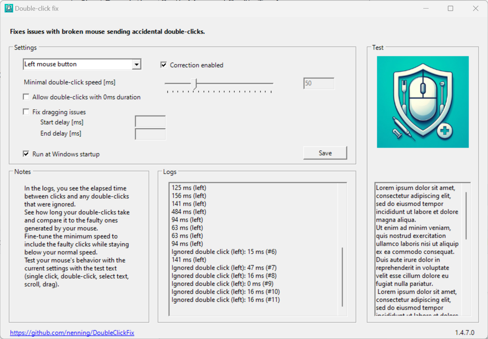

# 🖱️ Double-click Fix

 &nbsp;  &nbsp;  &nbsp; 

A lightweight solution for mitigating double-click issues caused by malfunctioning mice.

**New in release 1.4:** 🎉 **Experimental Drag & Drop Support** – if you have problems with dragging, enable this feature in the UI! The tool will maintain a stable drag until you intentionally release.

This tool ensures smoother operation by filtering unintended double-click events and supporting reliable drag-and-drop gestures, allowing you to define the minimal delay between valid clicks directly from an intuitive user interface.

### 🛍️ Get it from the [Microsoft Store](https://apps.microsoft.com/detail/9PDGM7NL2FF2?hl=en-us&gl=CH&ocid=pdpshare)!

## 📋 Table of Contents
- [Features](#-features)
- [How It Works: Filtering Mouse Clicks](#️-how-it-works-filtering-mouse-clicks)
- [System Requirements](#-system-requirements)
- [Installation](#-installation)
- [Configuration](#️-configuration)
- [Contributions](#-contributions)
- [License](#-license)
- [Compatibility with Anti-Cheat Software](#️-compatibility-with-anti-cheat-software-vac-eac-battleye-etc)
- [Technical Notes](#️-technical-notes)

---

## ✨ Features
- **Drag & Drop Fix (New!)**: You can enable this in the UI. Hold, drag, and drop reliably — even if your mouse switch chatters during the gesture. A short pause while dragging is treated as the true release, preventing accidental drops.
- **Customizable Delay**: Adjust the minimal delay between two clicks via a user-friendly interface. Default is 50 ms.
- **Customize for Specific Mouse Buttons**: Choose which mouse buttons to fix, including left, right, middle, X1, and X2. Default is left mouse button only.
- **Windows Tray Integration**: Double-click the tray icon to open the settings UI.
- **Startup Option**: Register the application to launch with Windows. The app tries to do this automatically when you launch it the first time.

---

## 🛠️ How It Works: Filtering Mouse Clicks

This application intercepts mouse events at a low level to distinguish between intentional clicks and unintentional "bouncing" or "chattering" from a faulty mouse switch. Here’s a step-by-step breakdown of the process:

1.  **Low-Level Mouse Hook**: The application registers a `WH_MOUSE_LL` (low-level mouse) hook. This allows it to intercept mouse input events system-wide before they are passed to applications.
2.  **Event Interception**: Every mouse event, such as `WM_LBUTTONDOWN` (left button down) or `WM_MOUSEMOVE` (mouse move), is captured by a callback function.
3.  **Double-Click Filtering**:
    *   When a mouse button **down** event occurs, the application measures the time elapsed since the last corresponding **up** event for that same button.
    *   If this duration is shorter than the user-defined **threshold** (e.g., 50 ms), the event is considered an erroneous double-click and is "swallowed" or ignored. This prevents the system and other applications from ever receiving it.
    *   If the duration is longer than the threshold, the click is considered intentional and is passed along to the system as usual.
4.  **Drag & Drop Correction**: Faulty mice can also interfere with drag-and-drop operations by sending spurious "up" events while the button is being held down. The "Fix dragging issues" feature addresses this:
    *   **Entering Drag-Lock**: When you press and hold a mouse button and then move the cursor beyond a small distance, the application enters a "drag-lock" mode for that button.
    *   **Suppressing Jitter**: While in drag-lock, any subsequent `down` or `up` events for that button are ignored. This ensures that the drag is not accidentally interrupted.
    *   **Releasing the Drag**: The drag is released only when you stop moving the mouse for a user-defined period (the "Drag release delay"). At that point, a genuine "up" event is sent, completing the drag-and-drop action.
5.  **Forwarding Events**: Any event that is not filtered out is forwarded to the next hook in the chain using `CallNextHookEx`, ensuring normal mouse behavior for all other applications.

This entire process is highly efficient and runs in the background with minimal performance impact, ensuring a smoother experience without interfering with your regular workflow or gaming.

---

## 📋 System Requirements
- **Operating System**: Windows 10 or later.
- **.NET Runtime**: [.NET 8.0 Desktop Runtime](https://dotnet.microsoft.com/en-us/download/dotnet/8.0) or later (usually installed automatically).

---

## 🚀 Installation

The following options are supported for installing and running the application:

### Install from Microsoft Store (recommended)
1. Go to the [Store page](https://apps.microsoft.com/detail/9PDGM7NL2FF2?hl=en-us&gl=CH&ocid=pdpshare) and install it.

### Manual Setup
1. **Download**: Grab the latest release from the [Releases page](https://github.com/nenning/DoubleClickFix/releases).
2. **Unzip & Run**: Extract the files and execute the `.exe`.
    - Note: You might need to install the [.NET Runtime](https://dotnet.microsoft.com/en-us/download/dotnet) first.
    - Note: Settings are stored in the registry under `HKEY_CURRENT_USER\Software\DoubleClickFix`.
    - Note: If you move the app to a different folder, you have to deregister & re-register the app to start with Windows.

### Advanced Setup
- **Build from Source**: Clone the repository and compile the application yourself using Visual Studio or your preferred .NET toolchain.

---

## ⚙️ Configuration

### Settings
- Settings can be adjusted in the UI, including:
  - **Per-button delay**: Minimal delay between clicks for each button.
  - **Ignored devices:** Specifies which device to ignore (e.g., touchpad or touchscreen). By default, device ID `0` is ignored, but this can be modified if needed (experimental).
  - **Fix dragging issues**: Enables this only if you have problems with dragging (& dropping).
  - **Drag start delay**: The time (in ms) a drag action must take to enter the drag lock state.
  - **Drag release delay**: The time (in ms) you must hold the button after stopping movement before the release is registered. Alternatively, you can manually click to exit the drag lock.

### 💡 Tips
- Check the logs in the UI for detailed information on the elapsed time between your mouse clicks and filterd out double-clicks.
- Experiment with different delay settings to optimize for your personal double-click speed and specific hardware issues.
- Use the test area on the right side of the UI to test your settings (try also triple-clicking to select a whole paragraph and selecting text).

### Handling Touch Devices
- All double-clicks from touchpads or touchscreens are allowed by default.
- If you have trouble with this, enable the **Allow 0 ms Double-Click Duration** option in the UI.

---

## 🤝 Contributions
Contributions are welcome! Feel free to open issues, submit pull requests, or suggest improvements via the [Issues tab](https://github.com/nenning/DoubleClickFix/issues).

---

## 📜 License
This project is distributed under the [MIT License](LICENSE.txt).

---

## ℹ️ Compatibility with Anti-Cheat Software (VAC, EAC, BattlEye, etc.)

### How DoubleClickFix Works
This application uses a **low-level mouse hook** (`WH_MOUSE_LL`) to intercept and process mouse input events system-wide. Its sole purpose is to filter rapid, unintended clicks from faulty hardware and to stabilize drag-and-drop gestures. It does **not**:
- Inject code into other processes.
- Read or write the memory of any game.
- Modify game files or assets.
- Automate gameplay or provide any unfair advantage.

### Why This Is Generally Safe
Modern anti-cheat systems like Valve Anti-Cheat (VAC), Easy Anti-Cheat (EAC), and BattlEye are primarily designed to detect software that gives players an unfair competitive advantage. Their detection methods focus on:
1.  **Known Cheat Signatures**: Scanning for hashes of known cheating programs.
2.  **Process/Memory Manipulation**: Detecting unauthorized interaction with the game's process and memory space.
3.  **Code Injection**: Identifying attempts to inject DLLs or other code into the game client.

DoubleClickFix operates at the Windows input level, far removed from the game-specific vectors that anti-cheat systems monitor. Many legitimate accessibility tools and hardware drivers use similar low-level hooks without issue.

**Disclaimer**: While the risk is extremely low, no third-party tool can be guaranteed to be 100% safe with all present and future anti-cheat systems. The use of any system-level tool alongside protected games is at your own discretion. However, given its function and architecture, DoubleClickFix is considered a low-risk utility for addressing a hardware-level problem.
For official information, refer e.g. to Valve's [VAC documentation](https://help.steampowered.com/en/faqs/view/571A-97DA-70E9-FF74).
---

## 🛠️ Technical Notes
Some technical details mostly for development.

### 🖥️ Command-Line Arguments
- **`-nohook`** – Runs the app without registering the mouse hook. Useful for UI testing or debugging (automatically applied in debug mode).
- **`-interactive`** or **`-i`** – Displays the UI on startup. Useful for testing (automatically applied in debug mode).

### 🌍 Language Override
- The application language can be overridden by setting the **`languageOverride`** key in the `app.config` file (for testing purposes).

### 📦 Creating a Release

#### Github
- To create a github release (zip), run the following commands:
    - `git tag -a v1.0.1.0`
    - `git push origin v1.0.1.0`
- This will trigger the GitHub Action that creates the release.
- Add the release notes on GitHub.

#### Microsoft Store
- If needed, adjust the version in `Package.appxmanifest`.
- To create a store package, use **Publish** → **Create App Packages** in Visual Studio.
- Publish it through the [Partner Portal](https://partner.microsoft.com/en-us/dashboard/apps-and-games/overview): upload the package (`.msixbundle`), fill in the details and submit it for certification.
