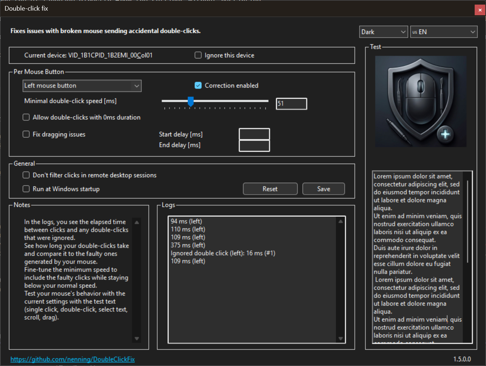
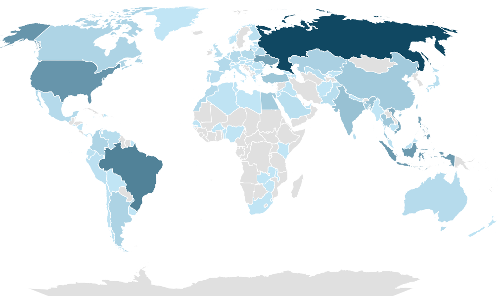

# 🖱️ Double-click Fix

 &nbsp;  &nbsp;  &nbsp; 

A lightweight tool that fixes accidental double-clicks caused by a worn-out or faulty mouse.

> Mentioned in [PCWorld](https://www.pcworld.com/article/2687259/what-to-do-if-your-mouse-is-double-clicking-when-you-dont-mean-it.html#:~:text=If%20the%20accidental%20double%2Dclicks%20persist%2C%20you%20can%20try%20using%20free%20software%20solutions%20such%20as%20Double%2DClick%20Fix%20(also%20available%20via%20the%20Microsoft%20Store)) and [PC-Welt (German)](https://www.pcwelt.de/article/2638630/so-vermeiden-sie-ungewollte-doppel-klicks-der-maus.html#:~:text=Sollte%20das%20Problem%20weiterhin%20bestehen%2C%20k%C3%B6nnen%20Sie%20auf%20kostenlose%20Softwarel%C3%B6sungen%20wie%20%E2%80%9EDoubleClickFix%E2%80%9C%20zur%C3%BCckgreifen.): *"you can try using free software solutions such as Double-Click Fix"*

**New in release 1.6:**
- 🚫 **Per-device Ignore List** – move the cursor with a second mouse or touchpad and check "Ignore this device" to exclude it from filtering. Saved permanently.
- 🖥️ **Remote Desktop Support** – enable the option in the UI to disable click filtering during RDP sessions.
- 🌗 **Dark / Light Theme** – choose between dark, light, or system theme in the settings.
- 🌐 **Language Switcher** – change the UI language directly from the settings without restarting.

---

# 🛍️ Get it from the [Microsoft Store](https://apps.microsoft.com/detail/9PDGM7NL2FF2?hl=en-us&gl=CH&ocid=pdpshare)!

---

## 📋 Table of Contents
- [Features](#-features)
- [System Requirements](#-system-requirements)
- [Installation](#-installation)
- [Configuration](#️-configuration)
- [How It Works: Filtering Mouse Clicks](#️-how-it-works-filtering-mouse-clicks)
- [Contributions](#-contributions)
- [License](#-license)
- [Compatibility with Anti-Cheat Software](#️-compatibility-with-anti-cheat-software-vac-eac-battleye-etc)
- [Technical Notes](#️-technical-notes)
- [Usage by Country](#-usage-by-country)

---

## ✨ Features
- **Double-click filtering** — filters accidental clicks per button with a configurable threshold. Default: 50 ms.
- **Drag & Drop Fix** — prevents faulty mice from dropping during a drag gesture.
- **Mouse Wheel Fix** — filters spurious reverse-direction scroll events.
- **Per-device Ignore List** — exclude specific devices (e.g. touchpad, second mouse) from filtering.
- **Remote Desktop Support** — optionally bypass filtering during RDP sessions.
- **Tray icon** — runs silently in the background; double-click to open settings.
- **Start with Windows** — registers to run automatically at startup.
- **Update notifications** (standalone) — checks GitHub for new releases on startup and shows a notification if one is available.

---

## 🖥️ System Requirements
- **Operating System**: Windows 10 or later.
- **.NET Runtime**: [.NET 10 Desktop Runtime](https://dotnet.microsoft.com/en-us/download/dotnet) or later (usually installed automatically).

---

## 🚀 Installation

### Install from Microsoft Store (recommended)
1. Go to the [Store page](https://apps.microsoft.com/detail/9PDGM7NL2FF2?hl=en-us&gl=CH&ocid=pdpshare) and install it.

### Manual Setup
1. **Download**: Grab the latest release from the [Releases page](https://github.com/nenning/DoubleClickFix/releases).
2. **Unzip & Run**: Extract the files and execute the `.exe`.
    - Settings are stored in the registry under `HKEY_CURRENT_USER\Software\DoubleClickFix`.
    - If you move the app to a different folder, deregister and re-register it to restore the startup entry.

### Build from Source
Clone the repository and build with Visual Studio or the .NET CLI.

---

## ⚙️ Configuration

### 🛠️ Settings
  - **Per-button delay**: Set the minimum time (in ms) between clicks for each button. Clicks arriving faster than this threshold are filtered out. Default: 50 ms, left button only.
  - **Fix dragging issues**: Enable only if your mouse drops items unexpectedly during a drag. While in drag-lock mode, spurious button events are ignored; a short pause at the end completes the release.
  - **Drag start delay**: Minimum drag duration (in ms) before entering drag-lock mode. Default: 1000 ms.
  - **Drag release delay**: Minimum time (in ms) the mouse must stay still before the button release is registered. You can also click manually to exit drag-lock mode. Default: 150 ms.
  - **Ignore this device**: Move the cursor with any device you want to exclude (e.g. a secondary mouse or graphics tablet), then check "Ignore this device". Saved permanently — survives reboots and Bluetooth reconnects.
  - **Workaround for touch devices**: Touch and touchpad clicks pass through unfiltered by default. Enable `Allow double-clicks with 0 ms gap` only if your touchpad or touchscreen isn't working correctly.
  - **Remote Desktop sessions**: Enable `Don't filter clicks in remote desktop sessions` if you control this PC via RDP and double-clicks aren't working.
  - **Theme**: Choose dark, light, or system (follows Windows setting).
  - **Language**: Switch the UI language directly from the settings.

### 💡 Tips
- Check the logs for the elapsed time between clicks and which double-clicks were filtered.
- Adjust the threshold until faulty clicks are caught while your normal double-click speed still works.
- Use the test area in the UI to verify your settings (try single-clicking, double-clicking, selecting text, and dragging).

---

## 🔍 How It Works: Filtering Mouse Clicks

The application intercepts mouse events at a low level to distinguish intentional clicks from "bouncing" or "chattering" caused by a faulty mouse switch.

1.  **Low-Level Mouse Hook**: Registers a `WH_MOUSE_LL` hook to intercept mouse events system-wide before they reach other applications.
2.  **Event Interception**: Every mouse event (`WM_LBUTTONDOWN`, `WM_MOUSEMOVE`, etc.) is captured by a callback function.
3.  **Double-Click Filtering**:
    *   When a mouse button **down** event occurs, the application measures the time elapsed since the last corresponding **up** event for that same button.
    *   If this duration is shorter than the user-defined **threshold** (e.g., 50 ms), the event is considered an erroneous double-click and is filtered out — the system and other applications never receive it.
    *   The matching **up** event for a suppressed down is also suppressed, preventing orphaned release events from reaching applications.
    *   If the duration is longer than the threshold, the click is considered intentional and passed along as usual.
4.  **Drag & Drop Correction**: Faulty mice can send spurious "up" events while holding a button, interrupting drags. The "Fix dragging issues" feature addresses this:
    *   **Entering Drag-Lock**: After pressing and holding a button and moving beyond a small distance, the app enters drag-lock mode for that button.
    *   **Suppressing Jitter**: While in drag-lock, spurious `down` or `up` events are ignored so the drag isn't accidentally interrupted.
    *   **Releasing the Drag**: The drag ends only after the mouse has been still for the configured release delay, at which point a genuine "up" event is sent.
5.  **Mouse Wheel Filtering**: Faulty wheels can scroll in the wrong direction momentarily, causing a jittery effect.
    *   **Direction-Aware Filtering**: The app tracks the last scroll direction (up/down or left/right).
    *   **Time-Based Debouncing**: A scroll in the *opposite* direction within the threshold is treated as jitter and ignored.
    *   **Preserving Fast Scrolling**: Intentional same-direction scrolling is never affected.
6.  **Forwarding Events**: Events that pass filtering are forwarded via `CallNextHookEx`, ensuring normal behavior for all other applications.

---

## 🤝 Contributions
Contributions are welcome! Feel free to open issues, submit pull requests, or suggest improvements via the [Issues tab](https://github.com/nenning/DoubleClickFix/issues).

---

## 📜 License
This project is distributed under the [MIT License](LICENSE.txt).

---

## 🎮 Compatibility with Anti-Cheat Software (VAC, EAC, BattlEye, etc.)

DoubleClickFix uses a `WH_MOUSE_LL` low-level mouse hook — the same mechanism used by accessibility tools and hardware drivers. It does **not**:
- Inject code into other processes.
- Read or write game memory.
- Modify game files or provide any gameplay advantage.

Anti-cheat systems (VAC, EAC, BattlEye) focus on cheat signatures, memory manipulation, and code injection — none of which apply here. The risk is considered very low.

**Disclaimer**: No third-party tool can be guaranteed safe with all future anti-cheat systems. Use alongside protected games is at your own discretion.

For official information, see Valve's [VAC documentation](https://help.steampowered.com/en/faqs/view/571A-97DA-70E9-FF74).

---

## 🛠️ Technical Notes
Technical details — mostly for development.

### 🖥️ Command-Line Arguments
- **`-nohook`** – Runs the app without registering the mouse hook. Useful for UI testing or debugging (automatically applied in debug mode).
- **`-interactive`** or **`-i`** – Displays the UI on startup. Useful for testing (automatically applied in debug mode).

### 📦 Creating a Release

#### GitHub
- To create a GitHub release (zip), run:
    - `git tag -a v1.0.1.0`
    - `git push origin v1.0.1.0`
- This will trigger the GitHub Action that creates the release.
- Add the release notes on GitHub.

#### Microsoft Store
- If needed, adjust the version in `Package.appxmanifest`.
- To create a store package, use **Publish** → **Create App Packages** in Visual Studio.
- Publish it through the [Partner Portal](https://partner.microsoft.com/en-us/dashboard/apps-and-games/overview): upload the package (`DoubleClickFix\DoubleClickFix.Package\AppPackages\*.msixbundle`), fill in the details and submit it for certification.

---

## 🌍 Usage by Country
Just FYI - Microsoft Store usage statistics for the last 30 days (2026-04-04):

| Country/Region | Active Devices | Sessions |
|---|---:|---:|
| Russia | 532 | 707 |
| Brazil | 336 | 467 |
| United States | 270 | 327 |
| Indonesia | 253 | 399 |
| Philippines | 227 | 316 |
| Ukraine | 221 | 331 |
| Vietnam | 197 | 250 |
| India | 123 | 199 |
| Turkey | 104 | 141 |
| Thailand | 100 | 153 |
| China | 93 | 125 |
| Bangladesh | 90 | 150 |
| Egypt | 86 | 120 |
| Korea | 74 | 104 |
| Singapore | 73 | 90 |
| Taiwan | 73 | 81 |
| Kazakhstan | 71 | 97 |
| Argentina | 62 | 80 |
| Colombia | 59 | 76 |
| Canada | 58 | 82 |
| Hong Kong SAR | 54 | 74 |
| Belarus | 47 | 69 |
| France | 42 | 47 |
| Germany | 41 | 48 |
| Morocco | 41 | 65 |
| Poland | 39 | 46 |
| Mexico | 37 | 48 |
| Australia | 34 | 39 |
| Estonia | 29 | 44 |
| Venezuela | 29 | 31 |
| Uzbekistan | 27 | 59 |
| Moldova | 27 | 34 |
| United Kingdom | 26 | 31 |
| Pakistan | 26 | 60 |
| Sri Lanka | 24 | 48 |
| Portugal | 23 | 25 |
| Spain | 23 | 25 |
| Finland | 21 | 32 |
| Saudi Arabia | 21 | 27 |
| Japan | 21 | 27 |
| Ecuador | 19 | 30 |
| Netherlands | 18 | 23 |
| Peru | 17 | 29 |
| Czech Republic | 14 | 14 |
| Trinidad and Tobago | 13 | 17 |
| Hungary | 13 | 14 |
| Chile | 11 | 14 |
| Malaysia | 10 | 10 |
| Austria | 10 | 11 |
| New Zealand | 9 | 12 |
| Cambodia | 9 | 11 |
| Iraq | 9 | 10 |
| United Arab Emirates | 8 | 11 |
| Slovakia | 8 | 10 |
| Algeria | 7 | 8 |
| Dominican Republic | 7 | 7 |
| Panama | 7 | 8 |
| Jordan | 7 | 7 |
| Romania | 7 | 7 |
| Israel | 6 | 6 |
| Switzerland | 6 | 7 |
| Latvia | 6 | 6 |
| Reunion | 6 | 8 |
| Greece | 5 | 6 |
| Palestinian Authority | 5 | 7 |
| Cyprus | 5 | 5 |
| Swaziland | 5 | 5 |
| Nepal | 4 | 8 |
| Georgia | 4 | 5 |
| Bulgaria | 4 | 4 |
| El Salvador | 4 | 4 |
| Serbia | 3 | 3 |
| South Africa | 3 | 3 |
| Kyrgyzstan | 3 | 4 |
| Azerbaijan | 3 | 3 |
| Tunisia | 3 | 3 |
| Nigeria | 3 | 4 |
| Senegal | 3 | 3 |
| French Guiana | 2 | 2 |
| Belgium | 2 | 2 |
| Bolivia | 2 | 2 |
| Seychelles | 2 | 2 |
| Greenland | 2 | 2 |
| Kenya | 2 | 2 |
| Zambia | 1 | 1 |
| Uruguay | 1 | 1 |
| Zimbabwe | 1 | 1 |
| Benin | 1 | 2 |
| Nicaragua | 1 | 1 |
| Jamaica | 1 | 1 |
| Norway | 1 | 1 |
| Lithuania | 1 | 1 |
| Armenia | 1 | 1 |
| Burkina Faso | 1 | 1 |
| Myanmar | 1 | 1 |
| Libya | 1 | 1 |
| Italy | 1 | 1 |
| Afghanistan | 1 | 3 |
| Malawi | 1 | 3 |
